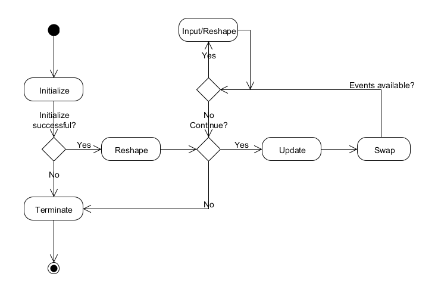

# GLUS - Cross platform and cross graphic library utilities

The cross platform and cross Graphic Library UtilitieS (GLUS) is an open-source C library, which provides a hardware (HW) and operating system (OS) abstraction plus many functions usually needed for graphics programming using OpenGL, OpenGL ES or OpenVG.

* * *

## Download

Visit [GLUS repository on GitHub](https://github.com/McNopper/GLUS) for the GLUS library source code.  
Visit [OpenGL repository on GitHub](https://github.com/McNopper/OpenGL) for the GLUS library plus many OpenGL 3 and 4 examples source code.  
Visit [OpenGL ES repository on GitHub](https://github.com/McNopper/OpenGL_ES) for the GLUS library plus OpenGL ES 2.0, 3.0 and 3.1 examples source code.  
Visit [OpenVG repository on GitHub](https://github.com/McNopper/OpenVG) for the GLUS library plus OpenVG 1.1 examples source code.  

* * *

## Features

*   Same interface on different HW and OS
*   Tested on Windows, Linux, Mac OS X with AMD and NVIDIA GPUs. Also tested on the Raspberry Pi and the [i.MX6](http://www.freescale.com/webapp/sps/site/taxonomy.jsp?code=IMX6X_SERIES)
*   GLUT like rendering loop plus providing delta/passed time and terminate callback function
*   EGL surface and context parameters used on all platforms for initialization
*   Extension and version checking functions
*   Logging functions
*   Basic FPS profiling function
*   Screenshot and automatic screenshot for movie clip generation functions
*   Dynamic memory wrapper. Optional basic memory manager available
*   GLSL shader loading and program building
*   Image loading (TGA, HDR and PKM) and saving (TGA and HDR)
*   Binary and text file loading and saving
*   Distance functions for Plane, Sphere, Axis-Aligned- and Oriented-Bounding-Box
*   Ray-intersection function for Sphere
*   Basic mathematics functions
*   Matrix and vector mathematics functions
*   Special matrix functions: View, orthogonal and perspective projection, planar reflection, planar shadow with point and directional light
*   Complex number mathematics functions
*   Quaternion mathematics functions
*   Fourier transform mathematics functions
*   Random number functions
*   Perlin noise generation functions for 1D, 2D and 3D images
*   Line based geometry generation functions: Line, Square, Rectangle, Circle
*   Triangle based geometry generation functions: Planes, Disc, Cube, Sphere, Dome, Torus, Cylinder and Cone
*   Wavefront object file (OBJ) loading functions with and without materials
*   Adjacent vertices calculation functions for 3D objects
*   Texture coordinate calculation functions for 3D objects
*   Helper functions, to set up ray trace buffers
*   Converter functions for vectors and images

* * *

## Compatibility

GLUS is written in ANSI C and uses [GLFW](http://www.glfw.org/) and [GLEW](http://glew.sourceforge.net/) for desktop OpenGL. For OpenGL ES and OpenVG on embedded systems or desktop simulations, [EGL](https://www.khronos.org/egl) and platform dependent code and libraries are used.

* * *

## Usage

The following source code shows a minimal OpenGL 3.2 program using GLUS:

<tt>/**  
* Include GLUS. Needed OpenGL, OpenGL ES or OpenVG headers will be included depending on the build profile.  
*/  
#include "GL/glus.h"  

/**  
* Function for initialization.  
*  
* @return GLUS_TRUE when initalization succeeded, otherwise GLUS_FALSE and the application will exit.  
*/  
GLUSboolean init(GLUSvoid)  
{  
    // The background will be just cleared with blue color.  
    glClearColor(0.0f, 0.0f, 1.0f, 0.0f);  

    return GLUS_TRUE;  
}  

/**  
* Function is called before first update and every time when the window is resized.  
*  
* @param width  The width of the window.  
* @param height The height of the window.  
*/  
GLUSvoid reshape(GLUSint width, GLUSint height)  
{  
    // Set the viewport depending on the width and height of the window.  
    glViewport(0, 0, width, height);  
}  

/**  
* Function to update and render content. Swapping of the buffers is automatically done.  
*  
* @param time The passed / delta time from last frame.  
*  
* @return GLUS_TRUE for continuing, GLUS_FALSE to exit the application.  
*/  
GLUSboolean update(GLUSfloat time)  
{  
    // Now, the background is painted blue.  
    glClear(GL_COLOR_BUFFER_BIT);  

    return GLUS_TRUE;  
}  

/**  
* Function to clean up things.  
*/  
GLUSvoid terminate(GLUSvoid)  
{  
    // No resources have to be freed in this case.  
}  

/**  
* Main entry point.  
*/  
int main(int argc, char* argv[])  
{  
    // Parameters for the used window surface. See EGL man pages for more info.  
    EGLint eglConfigAttributes[] = {  
        EGL_RED_SIZE, 8,  
        EGL_GREEN_SIZE, 8,  
        EGL_BLUE_SIZE, 8,  
        EGL_DEPTH_SIZE, 0,  
        EGL_STENCIL_SIZE, 0,  
        EGL_RENDERABLE_TYPE, EGL_OPENGL_BIT,  
        EGL_NONE  
    };  

    // Parameters for the used context. See EGL man pages for more info.  
    EGLint eglContextAttributes[] = {  
        EGL_CONTEXT_MAJOR_VERSION, 3,  
        EGL_CONTEXT_MINOR_VERSION, 2,  
        EGL_CONTEXT_OPENGL_FORWARD_COMPATIBLE, EGL_TRUE,  
        EGL_CONTEXT_OPENGL_PROFILE_MASK, EGL_CONTEXT_OPENGL_CORE_PROFILE_BIT,  
        EGL_NONE  
    };  

    glusWindowSetInitFunc(init);  

    glusWindowSetReshapeFunc(reshape);  

    glusWindowSetUpdateFunc(update);  

    glusWindowSetTerminateFunc(terminate);  

    // Create the used window. See GLUS man pages for different parameters.  
    if (!glusWindowCreate("GLUS Example Window", 640, 480, GLUS_FALSE, GLUS_FALSE, eglConfigAttributes, eglContextAttributes))  
    {  
        return -1;  
    }  

    // Enter the update render loop. See below state machine for more information.  
    glusWindowRun();  

    return 0;  
}  
</tt>

The live time of an application using GLUS is showed in the following state machine:  

The different parameters on how to initialize and use GLUS can be found in the different examples:  

*   [OpenGL 3 and 4 examples](https://github.com/McNopper/OpenGL)
*   [OpenGL ES 2.0, 3.0 and 3.1 examples](https://github.com/McNopper/OpenGL_ES)
*   [OpenVG 1.1 examples](https://github.com/McNopper/OpenVG)

Visit the [GLUS man pages](docs/) for the documentation of each available function.

* * *

## Copyright

The source code is licensed under the GNU LESSER GENERAL PUBLIC LICENSE. If another licence is needed, please contact the author.